# 电动汽车充电桩运营管理平台 - 数据库ER图

## 整体架构图

```mermaid
erDiagram
    %% ============================================
    %% 基础信息模块
    %% ============================================
    STATION {
        bigint id PK "场站ID"
        varchar name "场站名称"
        varchar code UK "场站编码"
        varchar logo_url "LOGO地址"
        varchar address "场站地址"
        decimal rated_capacity "变压器额定容量"
        tinyint status "状态"
        datetime create_time "创建时间"
    }

    USER {
        bigint id PK "用户ID"
        varchar username UK "用户名"
        varchar password "密码"
        varchar real_name "真实姓名"
        varchar phone "手机号"
        tinyint status "状态"
        datetime create_time "创建时间"
    }

    ROLE {
        bigint id PK "角色ID"
        varchar role_code UK "角色编码"
        varchar role_name "角色名称"
        varchar description "描述"
        tinyint status "状态"
    }

    USER_ROLE {
        bigint id PK "关联ID"
        bigint user_id FK "用户ID"
        bigint role_id FK "角色ID"
    }

    MENU {
        bigint id PK "菜单ID"
        bigint parent_id "父菜单ID"
        varchar menu_name "菜单名称"
        varchar menu_path "路由路径"
        int sort_order "排序"
    }

    ROLE_MENU {
        bigint id PK "关联ID"
        bigint role_id FK "角色ID"
        bigint menu_id FK "菜单ID"
    }

    %% ============================================
    %% 设备管理模块
    %% ============================================
    DEVICE_TYPE {
        bigint id PK "类型ID"
        varchar type_code UK "类型编码"
        varchar type_name "类型名称"
        varchar description "描述"
    }

    DEVICE {
        bigint id PK "设备ID"
        varchar device_code UK "设备编号"
        varchar device_name "设备名称"
        bigint type_id FK "设备类型ID"
        bigint station_id FK "场站ID"
        varchar area_code "区域编码"
        varchar position "具体位置"
        varchar manufacturer "生产厂家"
        decimal power_rating "额定功率"
        datetime commission_date "投运日期"
        datetime next_maintenance_date "下次维保日期"
        tinyint status "状态"
        decimal real_time_power "实时功率"
        decimal total_energy "累计充电量"
        datetime create_time "创建时间"
    }

    DEVICE_MAINTENANCE {
        bigint id PK "维保记录ID"
        bigint device_id FK "设备ID"
        tinyint maintenance_type "维保类型"
        date maintenance_date "维保日期"
        text maintenance_content "维保内容"
        decimal cost "维保费用"
        datetime create_time "创建时间"
    }

    DEVICE_OTA_RECORD {
        bigint id PK "升级记录ID"
        bigint device_id FK "设备ID"
        varchar old_version "旧版本"
        varchar new_version "新版本"
        tinyint status "状态"
        datetime start_time "开始时间"
        datetime end_time "结束时间"
    }

    %% ============================================
    %% 充电运营模块
    %% ============================================
    CHARGING_USER {
        bigint id PK "用户ID"
        varchar user_code UK "用户编号"
        varchar username "用户名"
        varchar phone "手机号"
        varchar plate_number "车牌号"
        bigint member_level_id FK "会员等级ID"
        decimal balance "账户余额"
        decimal total_consumption "累计消费"
        tinyint status "状态"
    }

    MEMBER_LEVEL {
        bigint id PK "等级ID"
        varchar level_code UK "等级编码"
        varchar level_name "等级名称"
        decimal discount_rate "折扣率"
        decimal min_consumption "最低消费门槛"
    }

    RESERVATION {
        bigint id PK "预约ID"
        varchar reservation_no UK "预约单号"
        bigint user_id FK "用户ID"
        bigint device_id FK "设备ID"
        bigint station_id FK "场站ID"
        datetime start_time "预约开始时间"
        tinyint status "状态"
        datetime create_time "创建时间"
    }

    CHARGING_ORDER {
        bigint id PK "订单ID"
        varchar order_no UK "订单编号"
        bigint user_id FK "用户ID"
        bigint device_id FK "设备ID"
        bigint station_id FK "场站ID"
        tinyint order_type "订单类型"
        datetime start_time "充电开始时间"
        datetime end_time "充电结束时间"
        decimal total_energy "总充电量"
        decimal total_fee "总费用"
        decimal actual_fee "实付金额"
        tinyint payment_status "支付状态"
        tinyint status "状态"
        datetime create_time "创建时间"
    }

    CHARGING_SESSION {
        bigint id PK "会话ID"
        bigint order_id UK "订单ID"
        bigint device_id FK "设备ID"
        bigint user_id FK "用户ID"
        decimal current_power "当前功率"
        decimal current_soc "当前SOC"
        decimal charged_energy "已充电量"
        tinyint status "状态"
        datetime update_time "更新时间"
    }

    %% ============================================
    %% 收益核算模块
    %% ============================================
    RATE_CONFIG {
        bigint id PK "费率ID"
        bigint station_id FK "场站ID"
        tinyint rate_type "费率类型"
        time start_time "开始时间"
        time end_time "结束时间"
        decimal electricity_price "电价"
        decimal service_price "服务费"
        date effective_date "生效日期"
        tinyint status "状态"
    }

    RATE_CONFIG_LOG {
        bigint id PK "记录ID"
        bigint rate_config_id FK "费率配置ID"
        decimal old_electricity_price "旧电价"
        decimal new_electricity_price "新电价"
        varchar change_reason "调整原因"
        datetime create_time "创建时间"
    }

    DAILY_SETTLEMENT {
        bigint id PK "结算ID"
        bigint station_id FK "场站ID"
        date settlement_date UK "结算日期"
        int total_orders "总订单数"
        decimal total_energy "总充电量"
        decimal total_fee "总营收"
        decimal actual_fee "实际收入"
        tinyint reconciliation_status "对账状态"
    }

    %% ============================================
    %% 告警与故障模块
    %% ============================================
    ALARM_RULE {
        bigint id PK "规则ID"
        varchar rule_name "规则名称"
        tinyint alarm_type "告警类型"
        tinyint alarm_level "告警级别"
        varchar trigger_condition "触发条件"
        varchar notify_method "通知方式"
        tinyint enabled "是否启用"
    }

    ALARM {
        bigint id PK "告警ID"
        varchar alarm_no UK "告警编号"
        tinyint alarm_type "告警类型"
        tinyint alarm_level "告警级别"
        bigint device_id FK "设备ID"
        bigint station_id FK "场站ID"
        text alarm_content "告警内容"
        tinyint status "状态"
        datetime create_time "告警时间"
    }

    FAULT_TICKET {
        bigint id PK "工单ID"
        varchar ticket_no UK "工单编号"
        bigint device_id FK "设备ID"
        bigint station_id FK "场站ID"
        tinyint fault_type "故障类型"
        text fault_description "故障描述"
        bigint reporter_id FK "上报人ID"
        tinyint status "状态"
        datetime expected_finish_time "预计完成时间"
        datetime create_time "创建时间"
    }

    %% ============================================
    %% 系统设置模块
    %% ============================================
    STATION_CONFIG {
        bigint id PK "配置ID"
        bigint station_id FK "场站ID"
        varchar config_key "配置键"
        text config_value "配置值"
        varchar config_desc "配置说明"
    }

    OPERATION_LOG {
        bigint id PK "日志ID"
        bigint user_id FK "用户ID"
        varchar module "操作模块"
        varchar operation "操作类型"
        varchar description "操作描述"
        tinyint status "状态"
        datetime create_time "操作时间"
    }

    %% ============================================
    %% 设备运行数据与物联网模块
    %% ============================================
    DEVICE_DATA_HISTORY {
        bigint id PK "数据ID"
        bigint device_id FK "设备ID"
        bigint station_id FK "场站ID"
        decimal power "功率"
        decimal voltage "电压"
        decimal current "电流"
        decimal temperature "温度"
        decimal total_load "场站总负荷"
        datetime data_time "数据时间"
    }

    IOT_DEVICE_MAPPING {
        bigint id PK "映射ID"
        bigint local_device_id UK "本地设备ID"
        varchar iot_device_code "物联网设备编码"
        varchar api_endpoint "数据接口地址"
        int sync_interval "同步间隔"
        tinyint sync_status "同步状态"
        datetime last_sync_time "最后同步时间"
    }

    %% ============================================
    %% 实体关系定义
    %% ============================================
    
    %% 基础信息模块关系
    USER ||--o{ USER_ROLE : "has"
    ROLE ||--o{ USER_ROLE : "has"
    ROLE ||--o{ ROLE_MENU : "has"
    MENU ||--o{ ROLE_MENU : "has"
    MENU ||--o{ MENU : "parent"

    %% 设备管理模块关系
    DEVICE_TYPE ||--o{ DEVICE : "categorizes"
    STATION ||--o{ DEVICE : "contains"
    DEVICE ||--o{ DEVICE_MAINTENANCE : "has"
    DEVICE ||--o{ DEVICE_OTA_RECORD : "has"
    DEVICE ||--|| IOT_DEVICE_MAPPING : "maps"

    %% 充电运营模块关系
    CHARGING_USER ||--o{ CHARGING_ORDER : "creates"
    CHARGING_USER ||--o{ RESERVATION : "makes"
    CHARGING_USER }o--|| MEMBER_LEVEL : "belongs_to"
    DEVICE ||--o{ CHARGING_ORDER : "services"
    STATION ||--o{ CHARGING_ORDER : "hosts"
    CHARGING_ORDER ||--|| CHARGING_SESSION : "has"
    DEVICE ||--o{ CHARGING_SESSION : "runs"
    STATION ||--o{ RESERVATION : "hosts"
    DEVICE ||--o{ RESERVATION : "reserved"

    %% 收益核算模块关系
    STATION ||--o{ RATE_CONFIG : "configures"
    RATE_CONFIG ||--o{ RATE_CONFIG_LOG : "tracks"
    STATION ||--o{ DAILY_SETTLEMENT : "generates"

    %% 告警与故障模块关系
    DEVICE ||--o{ ALARM : "triggers"
    STATION ||--o{ ALARM : "has"
    DEVICE ||--o{ FAULT_TICKET : "has"
    STATION ||--o{ FAULT_TICKET : "has"
    USER ||--o{ FAULT_TICKET : "reports"

    %% 系统设置模块关系
    STATION ||--o{ STATION_CONFIG : "configures"
    USER ||--o{ OPERATION_LOG : "generates"

    %% 设备运行数据关系
    DEVICE ||--o{ DEVICE_DATA_HISTORY : "records"
    STATION ||--o{ DEVICE_DATA_HISTORY : "monitors"
```

## 模块关系详解

### 1. 基础信息模块
- **station** ↔ **device**: 1对多，一个场站包含多个设备
- **user** ↔ **role**: 多对多，通过user_role关联
- **role** ↔ **menu**: 多对多，通过role_menu关联
- **menu** ↔ **menu**: 自关联，实现菜单树形结构

### 2. 设备管理模块
- **device_type** ↔ **device**: 1对多，设备类型分类
- **device** ↔ **device_maintenance**: 1对多，设备维保记录
- **device** ↔ **device_ota_record**: 1对多，OTA升级记录
- **device** ↔ **iot_device_mapping**: 1对1，物联网平台映射

### 3. 充电运营模块
- **charging_user** ↔ **charging_order**: 1对多，用户创建订单
- **charging_user** ↔ **member_level**: 多对1，用户会员等级
- **device** ↔ **charging_order**: 1对多，设备服务订单
- **charging_order** ↔ **charging_session**: 1对1，订单对应充电会话
- **charging_user** ↔ **reservation**: 1对多，用户预约记录

### 4. 收益核算模块
- **station** ↔ **rate_config**: 1对多，场站费率配置
- **rate_config** ↔ **rate_config_log**: 1对多，费率调整记录
- **station** ↔ **daily_settlement**: 1对多，场站日结算

### 5. 告警与故障模块
- **device** ↔ **alarm**: 1对多，设备触发告警
- **device** ↔ **fault_ticket**: 1对多，设备故障工单
- **user** ↔ **fault_ticket**: 1对多，用户上报工单

### 6. 设备运行数据
- **device** ↔ **device_data_history**: 1对多，设备运行历史
- **station** ↔ **device_data_history**: 1对多，场站负荷监控

## 数据库设计亮点

### 1. 规范化设计
- 所有表采用InnoDB引擎，支持事务
- 统一使用utf8mb4字符集，支持emoji
- 主键统一使用BIGINT AUTO_INCREMENT
- 外键通过索引实现，保证查询性能

### 2. 审计字段
- 所有业务表包含create_time、update_time
- 关键操作记录operator_id，便于追溯
- 费率调整、配置修改都有日志记录

### 3. 状态管理
- 设备状态：离线/在线/故障/维护中
- 订单状态：充电中/已完成/异常终止/已取消
- 告警级别：一般/重要/紧急，对应不同通知策略

### 4. 性能优化
- 高频查询字段建立索引
- 充电会话使用独立表，10秒刷新不影响订单表
- 历史数据表按时间索引，支持快速查询趋势

### 5. 物联网集成
- iot_device_mapping表实现本地设备与物联网平台映射
- 支持自定义同步间隔和数据接口
- 同步状态监控，便于故障排查
