# 监管与调度平台 - 数据库ER图

## 说明

本文档整合了**原有运营平台**与**新增监管平台**的完整数据库ER图，采用模块化分层展示。

---

## 一、完整ER图（Mermaid）

```mermaid
erDiagram
    %% ============================================
    %% 图例说明
    %% ============================================
    %% 颜色标识:
    %%   🟢 绿色模块 = 原有运营平台表
    %%   🔵 蓝色模块 = 监管平台新增表
    %%   🟡 黄色模块 = 扩展现有表
    
    %% ============================================
    %% 基础信息模块（复用+扩展）
    %% ============================================
    STATION {
        bigint id PK "场站ID"
        varchar name "场站名称"
        varchar code UK "场站编码"
        bigint operator_id FK "所属运营商ID 🆕"
        varchar region_code "区域编码 🆕"
        decimal coordinate_lat "纬度 🆕"
        decimal coordinate_lng "经度 🆕"
        varchar address "场站地址"
        tinyint access_status "接入状态 🆕"
        datetime last_report_time "最后上报 🆕"
        datetime create_time "创建时间"
    }

    REGION {
        bigint id PK "区域ID 🆕"
        varchar region_code UK "区域编码"
        varchar parent_code FK "父级区域编码"
        varchar region_name "区域名称"
        tinyint region_level "层级:1-市 2-区 3-街道"
    }

    USER {
        bigint id PK "用户ID"
        varchar username UK "用户名"
        varchar password "密码"
        varchar real_name "真实姓名"
        varchar phone "手机号"
        tinyint status "状态"
        datetime create_time "创建时间"
    }

    ROLE {
        bigint id PK "角色ID"
        varchar role_code UK "角色编码"
        varchar role_name "角色名称"
        varchar role_category "角色类别 🆕"
        varchar description "描述"
        tinyint status "状态"
    }

    USER_ROLE {
        bigint id PK "关联ID"
        bigint user_id FK "用户ID"
        bigint role_id FK "角色ID"
    }

    MENU {
        bigint id PK "菜单ID"
        bigint parent_id "父菜单ID"
        varchar menu_name "菜单名称"
        varchar menu_path "路由路径"
        int sort_order "排序"
    }

    ROLE_MENU {
        bigint id PK "关联ID"
        bigint role_id FK "角色ID"
        bigint menu_id FK "菜单ID"
    }

    %% ============================================
    %% 运营商管理模块（新增）
    %% ============================================
    OPERATOR {
        bigint id PK "运营商ID 🆕"
        varchar operator_code UK "运营商编码"
        varchar operator_name "运营商名称"
        varchar credit_code UK "统一社会信用代码"
        varchar legal_person "法人代表"
        varchar contact_person "联系人"
        int access_station_count "接入站点数"
        tinyint qualification_status "资质状态"
        varchar rating_grade "服务评级"
        decimal rating_score "评分"
        tinyint status "状态"
    }

    OPERATOR_QUALIFICATION {
        bigint id PK "资质ID 🆕"
        bigint operator_id FK "运营商ID"
        tinyint qualification_type "资质类型"
        varchar file_name "文件名称"
        varchar file_url "文件URL"
        date expiry_date "到期日期"
        tinyint audit_status "审核状态"
        datetime audit_time "审核时间"
    }

    ACCESS_APPLICATION {
        bigint id PK "申请ID 🆕"
        varchar application_no UK "申请编号"
        bigint operator_id FK "运营商ID"
        bigint station_id FK "站点ID"
        varchar station_name "站点名称"
        int total_devices "设备总数"
        tinyint audit_status "审核状态"
        datetime application_time "申请时间"
        datetime audit_time "审核时间"
    }

    OPERATOR_RATING {
        bigint id PK "评级ID 🆕"
        bigint operator_id FK "运营商ID"
        varchar rating_period "评级周期"
        decimal total_score "总分"
        varchar grade "等级:A/B/C/D"
        tinyint rating_type "评级类型"
    }

    OPERATOR_VIOLATION {
        bigint id PK "违规ID 🆕"
        varchar violation_no UK "违规编号"
        bigint operator_id FK "运营商ID"
        tinyint violation_type "违规类型"
        text violation_content "违规内容"
        tinyint penalty_type "处罚类型"
        tinyint rectification_status "整改状态"
    }

    %% ============================================
    %% 设备管理模块（复用+扩展）
    %% ============================================
    DEVICE_TYPE {
        bigint id PK "类型ID"
        varchar type_code UK "类型编码"
        varchar type_name "类型名称"
    }

    DEVICE {
        bigint id PK "设备ID"
        varchar device_code UK "设备编号"
        bigint type_id FK "设备类型ID"
        bigint station_id FK "场站ID"
        bigint operator_id FK "运营商ID 🆕"
        varchar region_code "区域编码 🆕"
        tinyint is_v2g "是否V2G桩 🆕"
        decimal power_rating "额定功率"
        tinyint status "状态"
        datetime last_comm_time "最后通讯 🆕"
        datetime create_time "创建时间"
    }

    DEVICE_MAINTENANCE {
        bigint id PK "维保ID"
        bigint device_id FK "设备ID"
        tinyint maintenance_type "维保类型"
        date maintenance_date "维保日期"
        text maintenance_content "维保内容"
        decimal cost "维保费用"
    }

    DEVICE_DATA_HISTORY {
        bigint id PK "数据ID"
        bigint device_id FK "设备ID"
        bigint station_id FK "场站ID"
        decimal power "功率"
        decimal voltage "电压"
        decimal current "电流"
        datetime data_time "数据时间"
    }

    %% ============================================
    %% 充电运营模块（复用）
    %% ============================================
    CHARGING_USER {
        bigint id PK "用户ID"
        varchar user_code UK "用户编号"
        varchar phone "手机号"
        varchar plate_number "车牌号"
        decimal balance "账户余额"
    }

    CHARGING_ORDER {
        bigint id PK "订单ID"
        varchar order_no UK "订单编号"
        bigint user_id FK "用户ID"
        bigint device_id FK "设备ID"
        bigint station_id FK "场站ID"
        bigint operator_id FK "运营商ID 🆕"
        varchar region_code "区域编码 🆕"
        datetime start_time "充电开始时间"
        decimal total_energy "总充电量"
        decimal total_fee "总费用"
        tinyint status "状态"
    }

    %% ============================================
    %% 告警与故障模块（复用+扩展）
    %% ============================================
    ALARM {
        bigint id PK "告警ID"
        varchar alarm_no UK "告警编号"
        tinyint alarm_type "告警类型"
        tinyint alarm_level "告警级别"
        bigint device_id FK "设备ID"
        bigint station_id FK "场站ID"
        bigint operator_id FK "运营商ID 🆕"
        varchar region_code "区域编码 🆕"
        text alarm_content "告警内容"
        tinyint status "状态"
        datetime create_time "告警时间"
    }

    ALARM_HANDLING_RECORD {
        bigint id PK "记录ID 🆕"
        bigint alarm_id FK "告警ID"
        tinyint handling_type "处理类型"
        bigint handler_id FK "处理人ID"
        text handling_content "处理内容"
        datetime create_time "创建时间"
    }

    ALARM_ESCALATION_RULE {
        bigint id PK "规则ID 🆕"
        tinyint alarm_level "告警级别"
        int timeout_minutes "超时时间(分钟)"
        varchar escalation_target_role "升级通知角色"
        tinyint enabled "是否启用"
    }

    FAULT_TICKET {
        bigint id PK "工单ID"
        varchar ticket_no UK "工单编号"
        bigint device_id FK "设备ID"
        bigint station_id FK "场站ID"
        tinyint fault_type "故障类型"
        text fault_description "故障描述"
        tinyint status "状态"
        datetime create_time "创建时间"
    }

    RECTIFICATION_NOTICE {
        bigint id PK "通知ID 🆕"
        varchar notice_no UK "通知编号"
        tinyint notice_type "通知类型"
        bigint target_operator_id FK "目标运营商ID"
        bigint target_device_id FK "目标设备ID"
        text issue_reason "下发原因"
        text rectification_requirement "整改要求"
        date deadline "整改期限"
        tinyint status "状态"
    }

    %% ============================================
    %% 车网互动与调度模块（新增）
    %% ============================================
    V2G_ACTIVITY {
        bigint id PK "活动ID 🆕"
        varchar activity_no UK "活动编号"
        varchar activity_name "活动名称"
        datetime start_time "开始时间"
        datetime end_time "结束时间"
        varchar region_code "活动区域编码"
        decimal actual_discharge_energy "实际放电电量"
        int participating_station_count "参与站点数"
        int participating_vehicle_count "参与车辆数"
        tinyint status "状态"
    }

    V2G_ACTIVITY_PARTICIPANT {
        bigint id PK "参与ID 🆕"
        bigint activity_id FK "活动ID"
        bigint operator_id FK "运营商ID"
        bigint station_id FK "站点ID"
        decimal discharge_energy "放电电量"
        decimal discharge_revenue "放电收益"
    }

    ORDERED_CHARGING_STRATEGY {
        bigint id PK "策略ID 🆕"
        varchar strategy_no UK "策略编号"
        bigint station_id FK "场站ID"
        bigint operator_id FK "运营商ID"
        tinyint strategy_type "策略类型"
        decimal execution_rate "执行率"
        tinyint status "状态"
    }

    DEMAND_RESPONSE_ACTIVITY {
        bigint id PK "活动ID 🆕"
        varchar activity_no UK "活动编号"
        varchar activity_name "活动名称"
        tinyint response_type "响应类型:1-削峰 2-填谷"
        decimal target_energy "目标电量(MWh)"
        decimal actual_energy "实际电量(MWh)"
        decimal completion_rate "完成率"
        tinyint status "状态"
    }

    DEMAND_RESPONSE_OPERATOR_RECORD {
        bigint id PK "记录ID 🆕"
        bigint activity_id FK "活动ID"
        bigint operator_id FK "运营商ID"
        decimal target_energy "目标电量"
        decimal actual_energy "实际电量"
        decimal completion_rate "完成率"
        tinyint is_qualified "是否合格"
        int rank "排名"
    }

    DISPATCH_TASK {
        bigint id PK "任务ID 🆕"
        varchar task_no UK "任务编号"
        tinyint dispatch_mode "调度模式:1-自动 2-人工"
        tinyint dispatch_type "调度类型"
        varchar region_code "区域编码"
        decimal total_charge_power "总充电功率(kW)"
        decimal total_discharge_power "总放电功率(kW)"
        decimal execution_rate "执行率"
        tinyint grid_constraint_status "电网约束状态"
        tinyint status "状态"
        datetime create_time "创建时间"
    }

    DISPATCH_STATION_ALLOCATION {
        bigint id PK "分配ID 🆕"
        bigint task_id FK "任务ID"
        bigint station_id FK "站点ID"
        varchar station_name "站点名称"
        bigint operator_id FK "运营商ID"
        decimal max_charge_power "最大充电功率"
        decimal max_discharge_power "最大放电功率"
        decimal actual_charge_power "实际充电功率"
        decimal actual_discharge_power "实际放电功率"
        decimal execution_deviation "执行偏差"
        tinyint execution_status "执行状态"
        decimal transformer_capacity "变压器容量"
    }

    DISPATCH_HISTORY {
        bigint id PK "历史ID 🆕"
        bigint task_id FK "任务ID"
        bigint station_id FK "站点ID"
        decimal charge_power_limit "充电功率上限"
        decimal discharge_power_limit "放电功率上限"
        datetime effective_start_time "有效开始时间"
    }

    %% ============================================
    %% 补贴管理模块（新增）
    %% ============================================
    SUBSIDY_APPLICATION {
        bigint id PK "申请ID 🆕"
        varchar application_no UK "申报编号"
        bigint operator_id FK "运营商ID"
        tinyint subsidy_type "补贴类型"
        varchar subsidy_period "补贴周期"
        decimal total_amount "申报金额"
        tinyint current_audit_stage "当前审核环节"
        tinyint audit_status "审核状态"
        tinyint status "发放状态"
    }

    SUBSIDY_AUDIT_RECORD {
        bigint id PK "审核ID 🆕"
        bigint application_id FK "申请ID"
        tinyint audit_stage "审核环节"
        tinyint audit_result "审核结果"
        varchar audit_opinion "审核意见"
        bigint auditor_id FK "审核人ID"
        datetime audit_time "审核时间"
    }

    SUBSIDY_RECORD {
        bigint id PK "发放ID 🆕"
        bigint application_id FK "申请ID"
        bigint operator_id FK "运营商ID"
        decimal amount "发放金额"
        datetime grant_time "发放时间"
        varchar grant_batch_no "发放批次号"
    }

    %% ============================================
    %% 政策管理模块（新增）
    %% ============================================
    POLICY {
        bigint id PK "政策ID 🆕"
        varchar policy_no UK "政策编号"
        varchar title "政策标题"
        text content "政策内容"
        datetime publish_time "发布时间"
        tinyint status "状态"
    }

    POLICY_PUSH_RECORD {
        bigint id PK "推送ID 🆕"
        bigint policy_id FK "政策ID"
        bigint operator_id FK "运营商ID"
        tinyint read_status "阅读状态"
        datetime push_time "推送时间"
    }

    %% ============================================
    %% 应急调度模块（新增）
    %% ============================================
    EMERGENCY_DISPATCH_COMMAND {
        bigint id PK "指令ID 🆕"
        varchar command_no UK "指令编号"
        tinyint command_type "指令类型:1-削峰 2-限充"
        bigint target_operator_id FK "目标运营商ID"
        text command_content "指令内容"
        datetime start_time "开始时间"
        tinyint status "状态"
        text execution_result "执行结果"
    }

    %% ============================================
    %% 统计与日志模块（新增+复用）
    %% ============================================
    V2G_EFFECT_STATS {
        bigint id PK "统计ID 🆕"
        varchar stats_period "统计周期"
        tinyint stats_type "统计类型"
        decimal total_peak_shave_energy "累计削峰电量"
        decimal total_valley_fill_energy "累计填谷电量"
        decimal total_user_revenue "用户收益总额"
    }

    OPERATOR_MONTHLY_STATS {
        bigint id PK "统计ID 🆕"
        bigint operator_id FK "运营商ID"
        varchar stats_month "统计月份"
        int station_count "站点数"
        decimal total_energy "总充电量"
        decimal total_revenue "总营收"
        decimal v2g_discharge_energy "V2G放电量"
    }

    OPERATION_LOG {
        bigint id PK "日志ID"
        bigint user_id FK "用户ID"
        varchar module "操作模块"
        varchar operation "操作类型"
        varchar description "操作描述"
        datetime create_time "操作时间"
    }

    %% ============================================
    %% 实体关系定义 - 基础信息模块
    %% ============================================
    USER ||--o{ USER_ROLE : "拥有"
    ROLE ||--o{ USER_ROLE : "分配"
    ROLE ||--o{ ROLE_MENU : "拥有"
    MENU ||--o{ ROLE_MENU : "授权"
    MENU ||--o{ MENU : "父级"

    %% ============================================
    %% 实体关系定义 - 区域与运营商模块
    %% ============================================
    REGION ||--o{ REGION : "包含"
    REGION ||--o{ STATION : "管辖"
    REGION ||--o{ DEVICE : "管辖"
    OPERATOR ||--o{ STATION : "运营"
    OPERATOR ||--o{ OPERATOR_QUALIFICATION : "持有"
    OPERATOR ||--o{ ACCESS_APPLICATION : "提交"
    OPERATOR ||--o{ OPERATOR_RATING : "获得"
    OPERATOR ||--o{ OPERATOR_VIOLATION : "记录"

    %% ============================================
    %% 实体关系定义 - 设备管理模块
    %% ============================================
    DEVICE_TYPE ||--o{ DEVICE : "分类"
    STATION ||--o{ DEVICE : "包含"
    OPERATOR ||--o{ DEVICE : "拥有"
    DEVICE ||--o{ DEVICE_MAINTENANCE : "维保记录"
    DEVICE ||--o{ DEVICE_DATA_HISTORY : "产生"

    %% ============================================
    %% 实体关系定义 - 充电运营模块
    %% ============================================
    CHARGING_USER ||--o{ CHARGING_ORDER : "创建"
    DEVICE ||--o{ CHARGING_ORDER : "服务"
    STATION ||--o{ CHARGING_ORDER : "产生"

    %% ============================================
    %% 实体关系定义 - 告警与故障模块
    %% ============================================
    DEVICE ||--o{ ALARM : "触发"
    STATION ||--o{ ALARM : "产生"
    OPERATOR ||--o{ ALARM : "归属"
    ALARM ||--o{ ALARM_HANDLING_RECORD : "处理记录"
    ALARM_ESCALATION_RULE }o--|| ALARM : "约束"
    DEVICE ||--o{ FAULT_TICKET : "故障"
    OPERATOR ||--o{ RECTIFICATION_NOTICE : "接收"

    %% ============================================
    %% 实体关系定义 - 车网互动与调度模块
    %% ============================================
    V2G_ACTIVITY ||--o{ V2G_ACTIVITY_PARTICIPANT : "参与"
    OPERATOR ||--o{ V2G_ACTIVITY_PARTICIPANT : "参与"
    STATION ||--o{ V2G_ACTIVITY_PARTICIPANT : "参与"
    STATION ||--o{ ORDERED_CHARGING_STRATEGY : "执行"
    DEMAND_RESPONSE_ACTIVITY ||--o{ DEMAND_RESPONSE_OPERATOR_RECORD : "参与"
    OPERATOR ||--o{ DEMAND_RESPONSE_OPERATOR_RECORD : "参与"
    DISPATCH_TASK ||--o{ DISPATCH_STATION_ALLOCATION : "分配"
    STATION ||--o{ DISPATCH_STATION_ALLOCATION : "接收"
    DISPATCH_TASK ||--o{ DISPATCH_HISTORY : "历史"
    STATION ||--o{ DISPATCH_HISTORY : "记录"

    %% ============================================
    %% 实体关系定义 - 补贴管理模块
    %% ============================================
    OPERATOR ||--o{ SUBSIDY_APPLICATION : "申报"
    SUBSIDY_APPLICATION ||--o{ SUBSIDY_AUDIT_RECORD : "审核"
    SUBSIDY_APPLICATION ||--o{ SUBSIDY_RECORD : "发放"

    %% ============================================
    %% 实体关系定义 - 政策管理模块
    %% ============================================
    POLICY ||--o{ POLICY_PUSH_RECORD : "推送"
    OPERATOR ||--o{ POLICY_PUSH_RECORD : "接收"

    %% ============================================
    %% 实体关系定义 - 应急调度模块
    %% ============================================
    OPERATOR ||--o{ EMERGENCY_DISPATCH_COMMAND : "接收"

    %% ============================================
    %% 实体关系定义 - 统计模块
    %% ============================================
    OPERATOR ||--o{ OPERATOR_MONTHLY_STATS : "月度统计"
```

---

## 二、模块关系详解

### 1. 基础信息模块
| 关系 | 说明 |
|-----|------|
| USER ↔ ROLE | 多对多，通过USER_ROLE关联 |
| ROLE ↔ MENU | 多对多，通过ROLE_MENU关联 |
| REGION → REGION | 自关联，实现三级区域树 |
| REGION → STATION | 一对多，区域管辖场站 |

### 2. 运营商管理模块
| 关系 | 说明 |
|-----|------|
| OPERATOR → STATION | 一对多，运营商运营场站 |
| OPERATOR → OPERATOR_QUALIFICATION | 一对多，持有多个资质 |
| OPERATOR → ACCESS_APPLICATION | 一对多，提交接入申请 |
| OPERATOR → OPERATOR_RATING | 一对多，历史评级记录 |
| OPERATOR → OPERATOR_VIOLATION | 一对多，违规记录 |

### 3. 设备管理模块
| 关系 | 说明 |
|-----|------|
| DEVICE_TYPE → DEVICE | 一对多，设备分类 |
| STATION → DEVICE | 一对多，场站包含设备 |
| DEVICE → DEVICE_MAINTENANCE | 一对多，维保记录 |
| DEVICE → DEVICE_DATA_HISTORY | 一对多，运行历史 |

### 4. 车网互动与调度模块
| 关系 | 说明 |
|-----|------|
| V2G_ACTIVITY → V2G_ACTIVITY_PARTICIPANT | 一对多，活动参与记录 |
| DEMAND_RESPONSE_ACTIVITY → DEMAND_RESPONSE_OPERATOR_RECORD | 一对多，响应参与记录 |
| DISPATCH_TASK → DISPATCH_STATION_ALLOCATION | 一对多，站点功率分配 |
| DISPATCH_TASK → DISPATCH_HISTORY | 一对多，调度历史记录 |

### 5. 补贴管理模块
| 关系 | 说明 |
|-----|------|
| SUBSIDY_APPLICATION → SUBSIDY_AUDIT_RECORD | 一对多，三级审核记录 |
| SUBSIDY_APPLICATION → SUBSIDY_RECORD | 一对多，发放记录 |

### 6. 政策管理模块
| 关系 | 说明 |
|-----|------|
| POLICY → POLICY_PUSH_RECORD | 一对多，推送记录 |

---

## 三、数据库设计亮点

### 1. 模块化分层设计
- **原有运营平台模块**: 保留原有表结构不变
- **监管平台新增模块**: 新增25张表，覆盖设施监管、车网调度、合规管理等
- **扩展现有表**: 通过ALTER TABLE添加operator_id、region_code字段实现关联

### 2. 区域层级体系
- 支持三级行政区划（市/区/街道）
- 通过region_code前缀匹配实现快速区域查询
- 支持按监管层级数据权限隔离

### 3. 审核流程完整
- **接入审核**: 申请→审核→通过/驳回
- **资质审核**: 提交→审核→有效期管理
- **补贴三级审核**: 初审→复核→终审，全流程留痕

### 4. 调度执行闭环
- 调度任务→功率分配→执行监控→偏差分析→历史记录
- 支持自动调度与人工干预双模式
- 电网约束实时监控

### 5. 告警升级机制
- 严重告警10分钟未处理自动升级
- 支持多级通知（站内信/短信/邮件）
- 告警处理全流程记录

### 6. 数据统计与分析
- 车网互动效果统计（月度/季度/年度）
- 运营商月度统计快照
- 支持报告导出（PDF/Excel）

---

## 四、表清单汇总

| 序号 | 表名 | 模块 | 状态 | 说明 |
|-----|------|------|------|------|
| 1 | station | 基础信息 | 扩展 | 新增operator_id、region_code等字段 |
| 2 | device | 基础信息 | 扩展 | 新增operator_id、region_code、is_v2g等字段 |
| 3 | charging_order | 充电运营 | 扩展 | 新增operator_id、region_code字段 |
| 4 | alarm | 告警管理 | 扩展 | 新增operator_id、region_code字段 |
| 5 | role | 权限管理 | 扩展 | 新增role_category字段 |
| 6 | region | 区域管理 | 🆕 新增 | 三级行政区划 |
| 7 | operator | 运营商管理 | 🆕 新增 | 运营商基础信息 |
| 8 | operator_qualification | 资质管理 | 🆕 新增 | 资质审核与有效期 |
| 9 | access_application | 接入审核 | 🆕 新增 | 场站接入申请 |
| 10 | operator_rating | 服务评级 | 🆕 新增 | 月度/季度/年度评级 |
| 11 | operator_violation | 违规管理 | 🆕 新增 | 违规记录与整改 |
| 12 | v2g_activity | V2G活动 | 🆕 新增 | V2G放电活动 |
| 13 | v2g_activity_participant | V2G参与 | 🆕 新增 | 活动参与记录 |
| 14 | ordered_charging_strategy | 有序充电 | 🆕 新增 | 充电策略执行 |
| 15 | demand_response_activity | 需求响应 | 🆕 新增 | 响应活动管理 |
| 16 | demand_response_operator_record | 响应记录 | 🆕 新增 | 运营商响应记录 |
| 17 | dispatch_task | 调度任务 | 🆕 新增 | 全网调度任务 |
| 18 | dispatch_station_allocation | 功率分配 | 🆕 新增 | 站点功率分配明细 |
| 19 | dispatch_history | 调度历史 | 🆕 新增 | 调度执行历史 |
| 20 | subsidy_application | 补贴申报 | 🆕 新增 | 三级审核流程 |
| 21 | subsidy_audit_record | 补贴审核 | 🆕 新增 | 审核记录 |
| 22 | subsidy_record | 补贴发放 | 🆕 新增 | 发放记录 |
| 23 | policy | 政策管理 | 🆕 新增 | 政策发布 |
| 24 | policy_push_record | 政策推送 | 🆕 新增 | 推送与阅读记录 |
| 25 | emergency_dispatch_command | 应急指令 | 🆕 新增 | 应急调度指令 |
| 26 | alarm_escalation_rule | 告警升级 | 🆕 新增 | 升级规则配置 |
| 27 | alarm_handling_record | 告警处理 | 🆕 新增 | 处理记录闭环 |
| 28 | rectification_notice | 整改通知 | 🆕 新增 | 整改通知下发 |
| 29 | v2g_effect_stats | 效果统计 | 🆕 新增 | 车网互动效果 |
| 30 | operator_monthly_stats | 月度统计 | 🆕 新增 | 运营商月度快照 |

---

> **最后更新**: 2026-04-18
> **文档维护**: 项目开发团队
